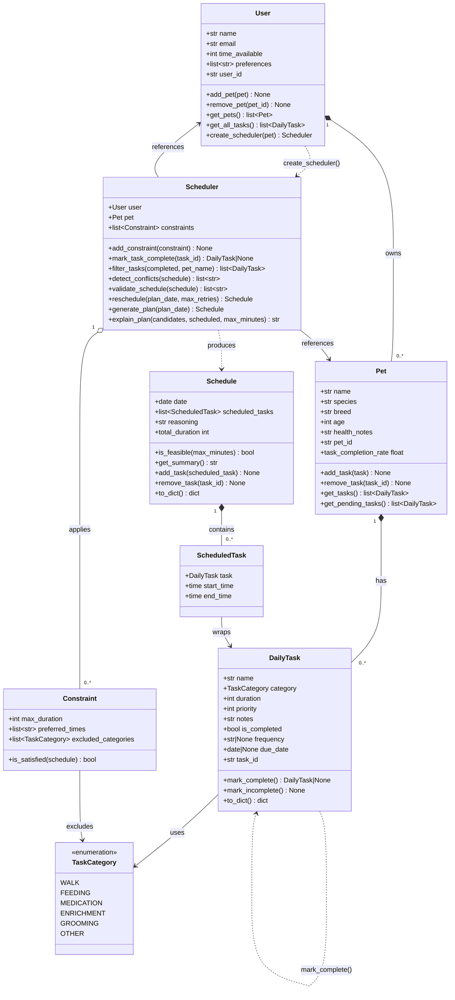

# PawPal+ (Module 2 Project)

You are building **PawPal+**, a Streamlit app that helps a pet owner plan care tasks for their pet.

## Features

- **Priority-first scheduling** — the scheduler sorts tasks by priority (highest first) and, when priorities tie, by duration (shortest first), so the most important care happens early and the day fills efficiently.
- **Category filtering** — `filter_tasks()` lets the app show only pending or completed tasks, and any category can be excluded from a plan entirely via a `Constraint` so tasks like grooming never appear on days the owner opts out.
- **Daily and weekly recurrence** — marking a task complete automatically creates a successor with the next due date (`+1 day` for daily, `+7 days` for weekly) and registers it on the pet, so recurring care like medication or grooming reappears in future plans without any manual re-entry.
- **Conflict detection** — `detect_conflicts()` scans a generated schedule for any two tasks that share the same start time and returns a plain-English warning for each collision, leaving the schedule unchanged so the owner can decide how to resolve it.

---

## Scenario

A busy pet owner needs help staying consistent with pet care. They want an assistant that can:

- Track pet care tasks (walks, feeding, meds, enrichment, grooming, etc.)
- Consider constraints (time available, priority, owner preferences)
- Produce a daily plan and explain why it chose that plan

Your job is to design the system first (UML), then implement the logic in Python, then connect it to the Streamlit UI.

## What you will build

Your final app should:

- Let a user enter basic owner + pet info
- Let a user add/edit tasks (duration + priority at minimum)
- Generate a daily schedule/plan based on constraints and priorities
- Display the plan clearly (and ideally explain the reasoning)
- Include tests for the most important scheduling behaviors

## Smarter Scheduling

Beyond the basic daily plan, the `Scheduler` class includes several features for more realistic pet care:

- **Recurring tasks** — set `frequency="daily"` or `frequency="weekly"` on any `DailyTask`. Calling `scheduler.mark_task_complete(task_id)` marks the task done and automatically registers a successor with the next `due_date` on the pet, so recurring care (e.g. daily medication, weekly grooming) reappears in future plans without manual re-entry.

- **Task filtering** — `scheduler.filter_tasks(completed, pet_name)` returns only the tasks matching the given criteria. Pass `completed=False` to see what still needs doing, `completed=True` to review what's finished, or both to scope results to a specific pet by name.

- **Conflict detection** — `scheduler.detect_conflicts(schedule)` scans a `Schedule` for tasks that share the same start time and returns a plain-English warning for each collision (e.g. `"Conflict: Walk and Feeding both scheduled at 08:00 for Biscuit"`). Returns an empty list when the schedule is clean.

- **Constraint validation** — `scheduler.validate_schedule(schedule)` checks the full schedule against every registered `Constraint` and the owner's daily time budget, returning a list of violation strings so the UI or terminal output can surface problems without raising exceptions.

## Getting started

### Setup

```bash
python -m venv .venv
source .venv/bin/activate  # Windows: .venv\Scripts\activate
pip install -r requirements.txt
```

## Testing PawPal+

```bash
python -m pytest tests/test_pawpal.py -v
```

The test suite covers the three core scheduling behaviors: tasks are placed in chronological order by start time, recurring tasks automatically produce a correctly-dated successor when marked complete, and the conflict detector flags any two tasks booked at the same time. Each behavior has a happy-path test and an edge-case test (e.g. equal-priority tie-breaking, a missing due date, three tasks at the same slot).

**Confidence rating:** ☆☆☆☆☆ / 5

---

## Class Diagram



---

### Suggested workflow

1. Read the scenario carefully and identify requirements and edge cases.
2. Draft a UML diagram (classes, attributes, methods, relationships).
3. Convert UML into Python class stubs (no logic yet).
4. Implement scheduling logic in small increments.
5. Add tests to verify key behaviors.
6. Connect your logic to the Streamlit UI in `app.py`.
7. Refine UML so it matches what you actually built.

<a href="C:\Users\ravur\projects\ai110-module2show-pawpal-starter\pawpal+.png" target="_blank"></a>.
